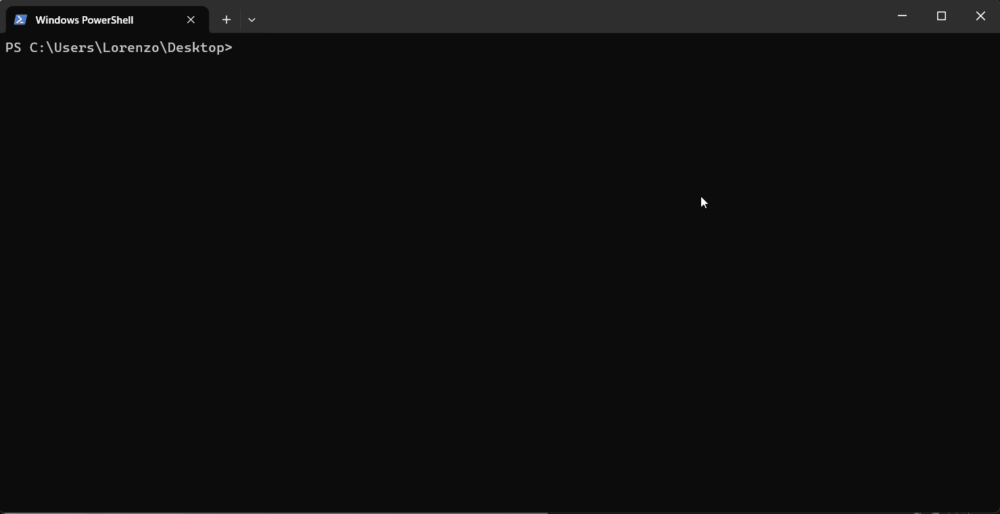

# MCPForge

Generate MCP servers from OpenAPI specs or docs pages, then turn raw API endpoints into a smaller set of tools that are actually useful for agents.

[](https://www.npmjs.com/package/mcpforge)
[](https://opensource.org/licenses/MIT)

## Demo



## Why It Exists

Most OpenAPI-to-MCP generators stop at endpoint wrappers. That gets you a server, but not necessarily a toolset an LLM can use well. You often end up with hundreds of low-signal tools, weak descriptions, and no clear path from "API surface area" to "jobs a user wants done."

MCPForge does two extra things:

- Curates endpoint tools with AI so the public surface stays small and usable.
- Plans task-oriented workflow tools that wrap useful jobs like `find_customers`, `create_payment_link`, or `refund_payment`.

The result is closer to "brief the model on the jobs it can do" than "dump the entire REST spec into MCP."

## Quick Start

From an OpenAPI spec:

```bash
npx mcpforge init --optimize --workflows https://api.example.com/openapi.json
```

From a docs page when you do not have a spec:

```bash
npx mcpforge init --from-url --workflows https://docs.stripe.com/api
```

Preview without writing files:

```bash
npx mcpforge init --dry-run --optimize --workflows https://api.example.com/openapi.json
```

## What MCPForge Does

- Parses OpenAPI 3.0, 3.1, and Swagger 2.0 specs from local files or URLs
- Scrapes docs pages and infers an API shape with Claude when no spec exists
- Curates raw endpoints into a smaller endpoint toolset with `--optimize`
- Plans task-oriented workflow tools with `--workflows`
- Generates a complete TypeScript MCP server with auth scaffolding and docs
- Detects upstream spec drift and reports risk-scored breaking changes
- Rebuilds and smoke-tests generated servers over stdio with `mcpforge test`

## Feature Overview

- **Workflow planning** - Generates first-class workflow tools with deterministic step execution. Workflow tools depend on real upstream operations, so drift can be tracked during `diff` and `update`.
- **AI endpoint curation** (`--optimize`) - Uses Claude to cap noisy APIs to a smaller, better-described public surface. Strict mode defaults to <=25 tools. Standard mode allows broader coverage up to 80.
- **Docs URL inference** (`--from-url`) - Scrapes API docs pages and infers endpoints when there is no public OpenAPI spec.
- **Interactive selection** (`--pick`) - Lets you choose the exact public tools to expose after planning and optimization.
- **Breaking change detection** (`diff`) - Compares stored source IR against the latest upstream spec and reports high, medium, and low-risk changes.
- **Workflow-aware update flow** (`update`) - Rechecks upstream APIs, reports workflow impact, and regenerates in place.
- **Generated-server verification** (`test`) - Installs dependencies, builds the generated project, validates `listTools`, and smoke-tests each public handler over stdio.
- **Repo-level CI and tests** - The repo now includes Vitest coverage for workflow planning, generation, diffing, and selection logic, plus a GitHub Actions workflow.

## Command Summary

- `mcpforge init <spec>` - Parse a spec or docs URL and generate a project. Use `--optimize` for endpoint curation, `--workflows` for task-oriented tools, `--pick` for interactive selection, and `--dry-run` to preview.
- `mcpforge generate` - Regenerate from `mcpforge.config.json`. Workflow mode, optimization mode, and tool selections are preserved in config.
- `mcpforge inspect <spec>` - Inspect API structure and warnings. Use `--workflows` to preview the planned public toolset.
- `mcpforge diff` - Compare the last stored source IR against the latest upstream version. Workflow-enabled projects also get workflow impact reporting.
- `mcpforge update` - Refresh from upstream changes and regenerate in place. Supports `--workflows`, `--raw-endpoints`, `--pick`, `--optimize`, and `--force`.
- `mcpforge test` - Rebuilds a generated server, validates registered tools, and smoke-tests public handlers. Use `--live` only when real credentials are configured.

## Workflow Mode

`--workflows` adds a planning layer on top of the parsed API:

- MCPForge starts from the parsed endpoint IR.
- If `--optimize` is enabled, it first curates which endpoints matter most.
- It then plans workflow tools around useful jobs and can keep a few curated endpoint fallbacks when needed.
- Each workflow stores which upstream operations it depends on, so future `diff` and `update` runs can report impact when those operations change.

Current workflow execution is intentionally deterministic:

- Linear steps only
- No arbitrary code generation
- Input mapping from workflow inputs and prior step results
- Output selection from saved step results

## AI Optimization

Use `--optimize` with `init` or `generate` to run Claude-based endpoint curation.

```bash
npx mcpforge init --optimize https://api.example.com/openapi.json
```

The optimizer:

- Curates to <=25 endpoint tools by default in strict mode
- Rewrites descriptions to be shorter and more LLM-friendly
- Removes admin, health, docs, and other low-value routes
- Prioritizes the endpoints most likely to matter for common user tasks

Use `--standard` for broader coverage or `--max-tools <n>` for a custom cap.

Requires `ANTHROPIC_API_KEY`. If it is missing, optimization is skipped and generation continues.

## Configuration

Generated projects include `mcpforge.config.json`. It stores:

- Spec source and source type
- Output directory
- Optimization settings
- Whether workflow planning is enabled
- Saved public tool selections
- Source IR, optimized IR, planned workflow IR, and final generated IR

That file is what makes `generate`, `diff`, and `update` work without repeating the original setup step.

## Testing Generated Servers

Run from inside a generated project:

```bash
npx mcpforge test
```

Or point at a generated project explicitly:

```bash
npx mcpforge test --dir ./mcp-server-my-api
```

By default, `mcpforge test`:

- runs `npm install` and `npm run build`
- starts the generated server over stdio
- verifies `listTools` matches `mcpforge.config.json`
- calls each public tool with minimal inputs
- treats structured handler errors as a pass in dry-run mode
- treats `401` and `403` as auth-required skips

Use `--live` only when the generated project's `.env` is configured and you want real upstream API calls.

## Tested Compatibility

MCPForge has been exercised against real-world specs across different formats and edge cases.

| API | Format | Endpoints | Status |
|-----|--------|-----------|--------|
| Twilio | OpenAPI 3.x | 197 | yes |
| Kubernetes | Swagger 2.0 | 1,085 | yes |
| Discord | OpenAPI 3.1 | 229 | yes |
| Notion | OpenAPI 3.0 | 13 | yes |
| PandaDoc | OpenAPI 3.0 | 115 | yes |
| Adyen | OpenAPI 3.1 | 2 | yes |
| Slack | YAML (OpenAPI 3.0) | 174 | yes |
| api.video | OpenAPI 3.0 (circular refs) | 47 | yes |
| Amadeus | Swagger 2.0 | 1 | yes |

Supports OpenAPI 3.0, 3.1, Swagger 2.0, JSON and YAML, circular `$ref`s, and specs with missing operation IDs. The broader compatibility report is in [examples/compatibility-report.md](./examples/compatibility-report.md).

## Contributing

Contributions are welcome. Open an issue for bugs or ideas, or submit a focused PR.

## License

MIT
